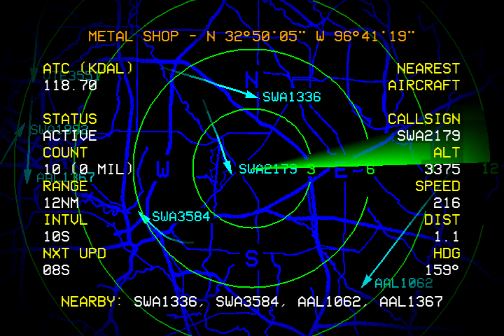

# JOAN JET (`joanjett`)

A retro CRT ADS-B flight radar for a Raspberry Pi -- a sweeping radar
display showing live aircraft in range, driven by a cheap RTL-SDR USB
dongle.

Built for a Raspberry Pi 3B+ running Raspberry Pi OS Bookworm, output
via the analog composite video jack to a CRT. Shares its console/
framebuffer architecture with [BARS](https://github.com/LawtonBarnes/bars)
-- headless pygame, direct `/dev/fb0` writes, raw `evdev` keyboard
input, exactly the same pattern used across every sibling app.



## Why this exists as a rewrite

An earlier version of this idea (internally called "retro-radar") used
a real SDL display surface via the `kmsdrm` driver, which needs full
KMS -- incompatible with the `vc4-fkms-v3d` overlay this hardware needs
for reliable composite video output (see [BARS](https://github.com/LawtonBarnes/bars)'s
README for the full explanation of that conflict). That version was
retired rather than fought with. JOAN JET is a from-scratch rebuild on
the same headless-pygame-plus-direct-framebuffer-writes architecture
every other app here already uses, which sidesteps the conflict
entirely.

## How it gets aircraft data

JOAN JET does **not** talk to the RTL-SDR dongle directly. A separate
ADS-B decoder, [readsb](https://github.com/wiedehopf/readsb) (a
`dump1090` derivative), runs as its own `systemd` service, reads the
dongle, decodes ADS-B messages, and writes live aircraft state to
`/run/readsb/aircraft.json`. JOAN JET just polls and renders that file
-- if aircraft aren't showing up, check `readsb` itself first
(`systemctl status readsb`, and whether `/run/readsb/aircraft.json` is
actually being updated) before assuming a bug in this app.

## Screens

Cycled with `←`/`→`:

- **radar** -- the sweeping radar display (rings, rotating sweep line,
  aircraft as blips)
- **aircraft** -- a list view of currently-tracked aircraft

## Controls

| Key | Action |
|---|---|
| `←` / `→` | Cycle between the radar and aircraft-list screens |
| `↑` / `↓` | Change the radar's range (zoom in/out) |
| `Home` | Quit to the app menu |
| `Q` / `Esc` / `Back` | Quit to the app menu |

## Hardware

- Raspberry Pi 3B+, Raspberry Pi OS (Debian 12 bookworm)
- An RTL-SDR USB dongle (RTL2832U-based) + a 1090MHz antenna (even a
  basic one picks up commercial air traffic at reasonable range)
- Composite video out to a CRT, same as every sibling app

## Installing on a fresh Pi

1. **Install `readsb`** -- follow [wiedehopf's install script](https://github.com/wiedehopf/readsb)
   for your hardware; this handles the RTL-SDR driver blacklisting
   (the kernel's built-in DVB-T driver needs to be blocked so
   `readsb` can claim the dongle) and gets you a running
   `readsb.service` writing to `/run/readsb/aircraft.json`. Confirm
   it's actually decoding real traffic (`systemctl status readsb`,
   check the JSON file's contents/mtime) before moving on -- JOAN JET
   has no way to distinguish "no aircraft nearby right now" from
   "readsb isn't working."

2. **Install JOAN JET's own dependencies:**
   ```bash
   sudo apt-get install -y python3-pygame python3-evdev python3-numpy python3-requests
   sudo git clone https://github.com/LawtonBarnes/joanjett.git /opt/joanjett
   ```

3. **Create the launcher:**
   ```bash
   sudo tee /usr/local/bin/joanjett > /dev/null << 'EOF'
   #!/bin/sh
   if [ "$(tty 2>/dev/null)" = "/dev/tty1" ]; then
       exec python3 /opt/joanjett/main.py "$@"
   else
       exec sudo openvt -f -c 1 -s -w -- python3 /opt/joanjett/main.py "$@"
   fi
   EOF
   sudo chmod +x /usr/local/bin/joanjett /opt/joanjett/main.py
   ```

4. **Enable composite video output** (same `vc4-fkms-v3d` requirement as
   [BARS](https://github.com/LawtonBarnes/bars) -- see that repo's
   README for the full config.txt steps).

5. **Set boot to console** and optionally **auto-launch on boot** --
   same steps as BARS's README, substituting `joanjett` for `bars`.

6. **Reboot** and confirm the radar sweep is live and aircraft appear
   as they pass overhead.

If you're running this as part of a [McBrain](https://github.com/LawtonBarnes/mcbrain)
fleet instead of standalone, skip steps 3/5 -- install alongside
[STRINGS](https://github.com/LawtonBarnes/strings) and assign it from
[SCRUTE](https://github.com/LawtonBarnes/scrutinizer) instead of a
manual launcher/autologin. Note that only whichever puppet physically
has the RTL-SDR dongle attached can actually run this usefully.

## Architecture

- `main.py` -- entry point: evdev input loop, FrameBuffer output,
  screen cycling, the continuous sweep-animation render loop
- `radar.py` -- the radar screen: rings, sweep line, vignette
- `aircraft.py` -- reads and parses `/run/readsb/aircraft.json`
- `aircraft_screen.py` -- the aircraft-list screen
- `mapdata.py` / `maprender.py` -- background map rendering
- `planes.py` -- aircraft blip rendering on the radar screen
- `geo.py` -- distance/bearing math (range/position relative to the
  receiver's own location)
- `compass.py` -- compass rose rendering
- `info.py` -- info overlay
- `colors.py` -- shared color constants
- `config.py` -- static configuration + `VERSION`
- `dev_snapshot.py` -- development/debugging helper, not needed at runtime
